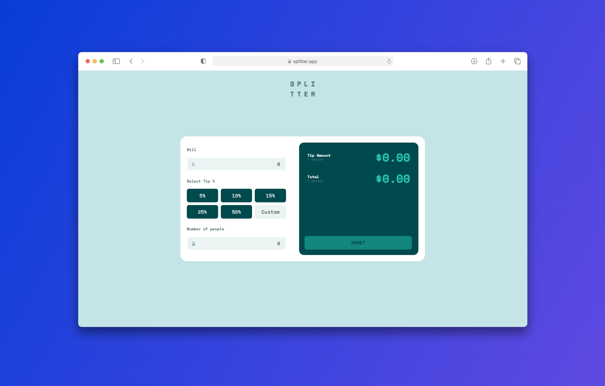

# Tip calculator app 💸

## About

This is a solution to the [Tip calculator app challenge on Frontend Mentor](https://www.frontendmentor.io/challenges/tip-calculator-app-ugJNGbJUX). Frontend Mentor challenges help you improve your coding skills by building realistic projects.

## Table of contents

- [Tip calculator app 💸](#tip-calculator-app-)
  - [About](#about)
  - [Table of contents](#table-of-contents)
  - [Overview](#overview)
    - [The challenge](#the-challenge)
  - [My process](#my-process)
    - [Built with](#built-with)
  - [Links](#links)
  - [Author](#author)

## Overview
### The challenge

Users should be able to:

- View the optimal layout for the app depending on their device's screen size
- See hover states for all interactive elements on the page
- Calculate the correct tip and total cost of the bill per person

## My process
### Built with

  

- JavaScript
- Sass
- Semantic HTML5 markup
- Flex and grid Layout

## Links

- Frontend Mentor solution: [Click here](https://tipcalculatorkdm.netlify.app/)
- Live Site URL: [Click here](https://tipcalculatorkdm.netlify.app/)

## Author

Challlenge by [Frontend Mentor](https://www.frontendmentor.io). Code by [Héctor Olivares](https://github.com/hectorolivares)

- Website - [Héctor Olivares](https://www.hectorolivares.me/)
- Frontend Mentor - [@hectorolivares](https://www.frontendmentor.io/profile/hectorolivares)
- Twitter - [@hektorolivares](https://twitter.com/hektorolivares)

